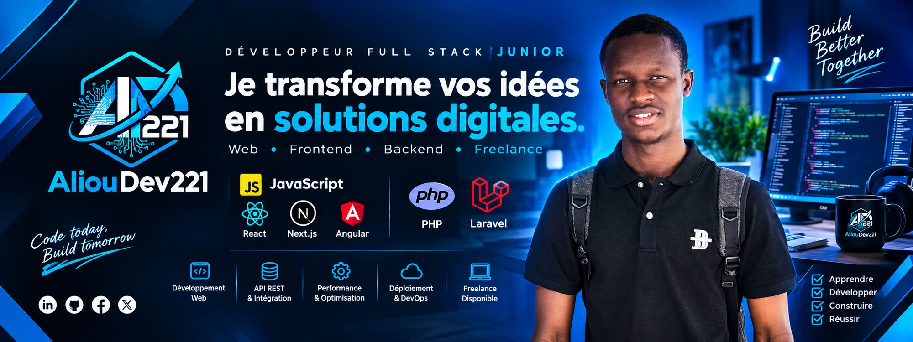

<!-- ===================== BANNER ===================== -->

  

<!-- ===================== HEADLINE ===================== -->

  
  

  

    
    
    
    
  

  
  
  
  

<!-- ===================== A PROPOS ===================== -->
## 🧑‍💻 À propos de moi

🎓 &nbsp;Étudiant en **Licence 3 Informatique – Génie Logiciel** à l'Université Iba Der Thiam de Thiès

💻 &nbsp;**Développeur Full Stack** — j'écris du **PHP / Laravel** côté serveur et du **React / Next.js / Angular** côté client

🏗️ &nbsp;Je construis des **applications web & SaaS** : gestion associative, e-commerce, plateformes académiques

🌍 &nbsp;Objectif : contribuer à la **transformation digitale en Afrique** avec des produits utiles et bien faits

🔐 &nbsp;J'aime les **API REST propres**, les architectures scalables et le code lisible

🎨 &nbsp;Aussi à l'aise en **design graphique** (affiches, flyers, identité visuelle)

🚀 &nbsp;**Freelance disponible** — ouvert aux missions, collaborations et opportunités

💬 &nbsp;Parlez-moi de **Laravel, React, Next.js, API REST, Tailwind CSS**

📫 &nbsp;Contact : **alioudev221@gmail.com**

 

<!-- ===================== STACK ===================== -->
## 🛠️ Mon arsenal technique

### Langages

### Frameworks & Librairies

### Bases de données & Backend

### Outils & DevOps

<b>📋 Voir le détail par catégorie</b>

 

| Catégorie | Technologies |
|---|---|
| **Langages** | JavaScript · TypeScript · PHP · SQL · Java · Python · Dart · HTML · CSS |
| **Frontend** | React · Next.js · Angular · Tailwind CSS · Bootstrap |
| **Backend** | Laravel · PHP · Node.js · API REST |
| **Mobile** | Flutter |
| **Bases de données** | MySQL · PostgreSQL · Supabase · Redis |
| **DevOps & Déploiement** | Git · GitHub Actions · Docker · Vercel |
| **Outils** | VS Code · IntelliJ IDEA · Android Studio · Postman · Figma · Linux |

<!-- ===================== SERVICES ===================== -->
## 💼 Ce que je peux faire pour vous

<table>
  <tr>
    <td width="33%" align="center" valign="top">
      
      <h3>Sites Web Vitrine</h3>
      
Des sites modernes et responsives qui présentent votre activité avec élégance.

      
<code>Responsive</code> <code>SEO</code> <code>Performance</code>

    </td>
    <td width="33%" align="center" valign="top">
      
      <h3>Applications Web</h3>
      
Applications dynamiques et interactives, du dashboard au SaaS complet.

      
<code>React / Next.js</code> <code>Laravel</code> <code>API REST</code>

    </td>
    <td width="33%" align="center" valign="top">
      
      <h3>Design Graphique</h3>
      
Affiches, flyers et supports visuels pour vos campagnes marketing.

      
<code>Identité visuelle</code> <code>Print</code> <code>Digital</code>

    </td>
  </tr>
</table>

<!-- ===================== PROJETS ===================== -->
## ⭐ Projets en vedette

<table>
  <tr>
    <td width="50%" valign="top">
      <h3>🎓 AERK-THIES</h3>
      
Plateforme académique et communautaire pour l'Amicale des Étudiants Ressortissants de Kaolack à Thiès : forum, dépôt de documents, gestion des membres et des rôles.

      
  

      <a href="https://alioudev221-v1.vercel.app/projets">Voir le projet →</a>
    </td>
    <td width="50%" valign="top">
      <h3>💰 GAFA-GUI</h3>
      
SaaS de gestion financière pour associations, amicales et clubs : suivi des cotisations, dépenses et rapports financiers automatisés.

      
   

      <em>Repository privé</em>
    </td>
  </tr>
  <tr>
    <td width="50%" valign="top">
      <h3>📚 Gestion de Bibliothèque</h3>
      
Système complet de gestion de bibliothèque : catalogue, emprunts, retours et administration des adhérents.

      
  

      <a href="https://github.com/Aliou221/bibliotheque">Voir le code →</a>
    </td>
    <td width="50%" valign="top">
      <h3>🏆 Challenge H24Code</h3>
      
Plateforme développée dans le cadre du challenge H24Code — conception, intégration et logique métier sous contrainte de temps.

      
 

      <a href="https://github.com/Aliou221/h24-code-challenge">Voir le code →</a>
    </td>
  </tr>
  <tr>
    <td width="50%" valign="top">
      <h3>🌤️ Application Météo</h3>
      
Prévisions météo en temps réel par géolocalisation, avec consommation d'API REST et interface thématique adaptative.

      
 

      <a href="https://app-meteo-lime.vercel.app/">Démo live →</a>
    </td>
    <td width="50%" valign="top">
      <h3>🧑‍💼 Portfolio v1</h3>
      
Mon portfolio professionnel : compétences, projets et parcours académique dans une interface moderne et optimisée.

      
  

      <a href="https://alioudev221-v1.vercel.app">Démo live →</a>
    </td>
  </tr>
</table>

  

<!-- ===================== STATS ===================== -->
## 📊 Mes statistiques GitHub

  

  

 

<!-- ===================== SNAKE ===================== -->

  

<!-- ===================== QUOTE ===================== -->

  

<!-- ===================== CONTACT ===================== -->
## 🤝 Travaillons ensemble

**Un projet en tête ? Une mission freelance ? Une opportunité ?**
Je réponds sous 24h.

 

  

### ✅ Apprendre &nbsp;&nbsp; ✅ Développer &nbsp;&nbsp; ✅ Construire &nbsp;&nbsp; ✅ Réussir

**« Code today, Build tomorrow. »**

 

